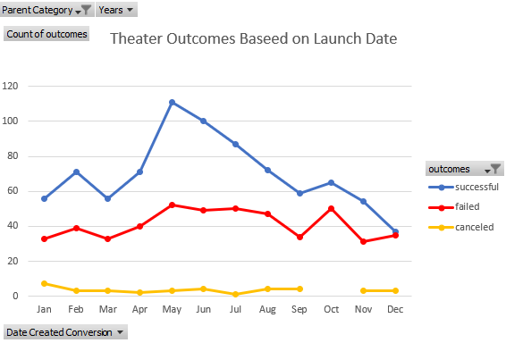

# Kickstarting with Excel

## Overview of Project

### Purpose
 &emsp;The purpose of the analysis is to evaluate the likely success or failure of Louise's fundraising campaign by using historical data from similar campaigns. 
## Analysis and Challenges
 &emsp;In order to help Louise, we first had to identify a variables and determine how that variable could have led to the success or failure of a campaign. In this case, the variables were the month the campaign was launched and total amount of the campaign goal. For this analysis, we are evaluating each variable independently. 

### Analysis of Outcomes Based on Launch Date
&emsp;Starting with the Launch Date Analysis, I created a pivot chart from the data in order to organize and roll up the larger data set. The pivot table also allowed me to narrow down the data to similar campaigns by filtering to only campaigns in the **theater** category.

 &emsp;The exact date of launch gave too many data points, so it was important to group the dates into months. Having previously converted the linux code to dates made using the **Year** function possible. The pivot fields needed to be cleaned up to remove additional date fields and leave only months.

 &emsp;Visualizing the data allows Louise to see the clear trends and advantages to certain months. A line chart was created with markers to show the number of successful and failed campaigns. We removed live campaigns since they were neither successful or failed. 

### Analysis of Outcomes Based on Goals
 &emsp; Moving on to the next analysis, we wanted to consider if the goal amount influenced the success of the campaign.

The next steps were to create additional data points by:
* Creating a new worksheet
* Creating buckets for the campaign amount that incremented by around 5,000
* Counting the number of campaigns that fell into each bucket by using the **Countif** function
  * counting if a campaign met the criteria for the goal amount bucket and was successful
  * counting if a campaign met the criteria for the goal amount bucket and failed
  * Determining what percentage of campaigns failed or succeeded for each goal bucket
  
 Finally, creating a line chart visualizes the analysis and gives a clear look at trend as seen below:

[Kickstarter_Challenge.xlsx](https://github.com/ErinLVigil/Kickstarter-analysis/files/9246104/Kickstarter_Challenge.xlsx)

### Challenges and Difficulties Encountered

I did not have challenges with this analysis, but did hear classmates discuss that the results could be skewed if you forgot to eliminate live campaigns. Another common problem was not converting the date field from the assignments in the modules. 

## Results
- What are two conclusions you can draw about the Outcomes based on Launch Date?
    1. More campaigns launched in early to mid summer were successful than any other time
    2. Campaigns launched in December were just as likely to fail as succeed

- What can you conclude about the Outcomes based on Goals?
    1. Goals that were very low were very likely to succeed and goals that are very high were very likely to fail
    2. Goals in the 3500- 4500 range were more likely to succeed, but with odds of only about 2 out of 3

- What are some limitations of this dataset?

The dataset has some limitations in only giving partial infornmation. When looking at outcomes based on launch date, we are not considering length of campaign, for example. We are also not considering any information about the sponser of the campaign. Veteran theater producers might have more successful campaigns than rookies. We are also not told if any of these plays have been produced in the last 5 years that could influence popularity or saturation. It would also be useful to know how these campaigns were promoted. For instance, how many times it was shared on social media could influence the outcome of a campaign far more than the launch month.

- What are some other possible tables and/or graphs that we could create?

We could make a stacked bar chart to show the total number of successful campaigns and unsuccessful campaigns that were a staff pick. This would let us know if this was a contributing factor. Another interesting chart could be similar to the goal amount, but using the length of the campaign for the buckets. By taking the deadline and the launch date, we could determine number of days and then perform a similar line chart analysis of the percentage of successful campaigns based on length. 
